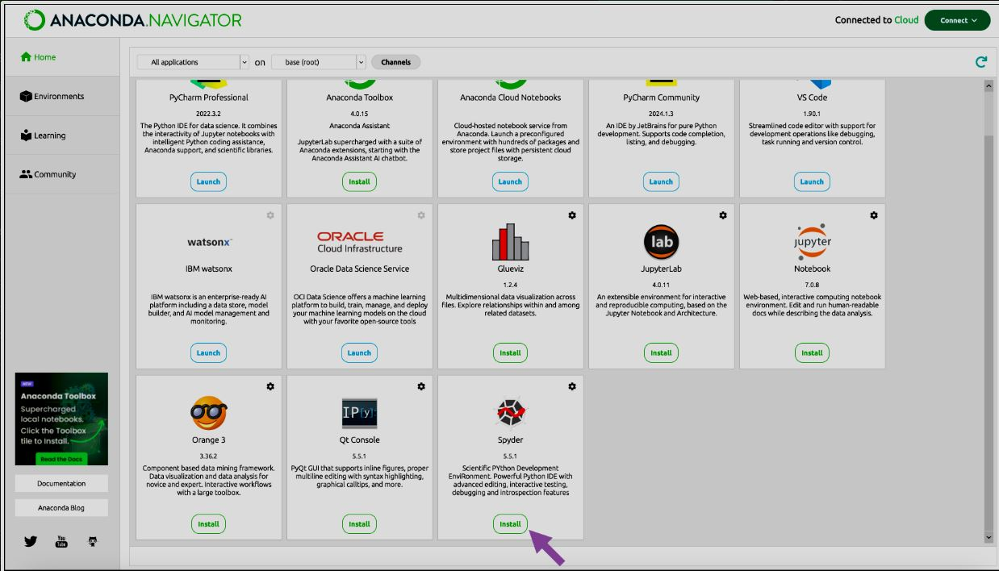

# 🌟 L'Environnement Anaconda : Un Guide Visuel

## 🐍 Qu'est-ce qu'Anaconda ?

Anaconda est une distribution Python gratuite et open source, spécialement conçue pour la science des données, l'apprentissage automatique et le calcul scientifique. Elle simplifie la gestion des packages et des environnements.

---

## 🧩 Composants Principaux

### 1. 📦 Distribution Python

Anaconda inclut **Python** et plus de **250 packages scientifiques pré-installés**, vous permettant de démarrer vos projets rapidement.

*Illustration montrant Python au centre, entouré de packages populaires comme NumPy, pandas, scikit-learn.*

---

### 2. ⚙️ Conda (Gestionnaire de Packages)

**Conda** est un outil puissant pour :
- Installer des bibliothèques.
- Créer des environnements virtuels isolés.
- Gérer les dépendances entre packages.

*Diagramme montrant différents environnements Conda avec leurs propres versions de Python et packages.*

---

### 3. 🖥️ Anaconda Navigator

Une interface graphique conviviale qui permet de :
- Gérer vos environnements.
- Installer des applications comme Spyder ou Jupyter Notebook.
- Lancer vos outils en un clic.

---

## 🔧 Outils Intégrés

### 🐞 Spyder : IDE Scientifique

Spyder est un **environnement de développement intégré (IDE)** conçu pour les scientifiques et analystes. Il inclut :
- Un éditeur de code avec complétion automatique.
- Une console interactive.
- Un explorateur de variables pour visualiser vos données.

*Capture d'écran de Spyder montrant l'éditeur, la console et l'explorateur.*

---

### 📓 Jupyter Notebook : Programmation Interactive

Jupyter Notebook est un outil interactif qui permet :
- D'écrire du code Python.
- De visualiser des graphiques.
- De documenter vos analyses dans un format clair et partageable.

*Exemple d'un notebook Jupyter avec du code, du texte formaté et des visualisations.*

---

## 🎯 Utilisations Principales

Voici comment Anaconda peut être utilisé dans vos projets :

| 🌟 **Domaine**             | 🔍 **Exemples**                     |
|----------------------------|-------------------------------------|
| 📊 Analyse de données      | Nettoyage, transformation, résumé  |
| 🤖 Apprentissage automatique | Modélisation prédictive            |
| 📈 Visualisation            | Graphiques interactifs             |
| 🔬 Calcul scientifique      | Simulations, algèbre linéaire      |

![Utilisations d'Anaconda](image_anaconda
